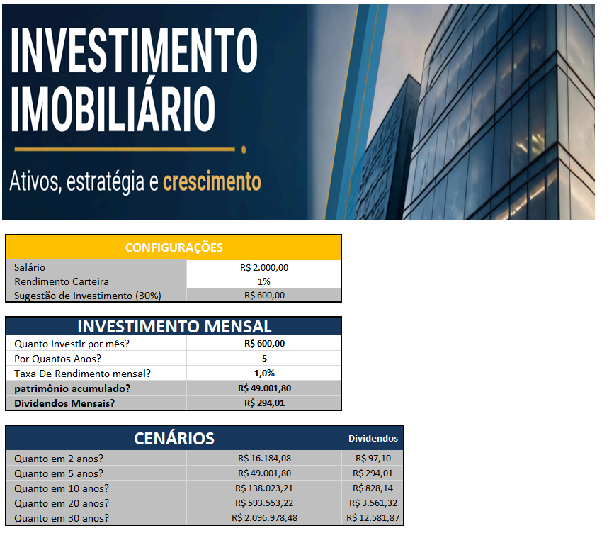

# Planilha de Investimentos em FIIs

## Sobre o projeto

Planilha desenvolvida em Excel para simulação de investimentos em Fundos de Investimento Imobiliário (FIIs).

A ferramenta permite projetar o crescimento do patrimônio e estimar dividendos a partir de diferentes valores de aporte, períodos e taxas de rendimento.

## Funcionalidades

- Cálculo do investimento mensal;
- Projeção de patrimônio acumulado;
- Estimativa de dividendos mensais;
- Simulações de 2, 5, 10, 20 e 30 anos;
- Cenários para diferentes perfis de investidor;
- Distribuição entre diferentes tipos de FIIs.

## Ferramentas

- Microsoft Excel
- GitHub

## Objetivo

Projeto desenvolvido como parte de um curso de Excel, com foco na aplicação de fórmulas e recursos de análise financeira.

> **Observação:** Projeto desenvolvido para fins educacionais. As projeções não representam recomendação ou garantia de rentabilidade.

